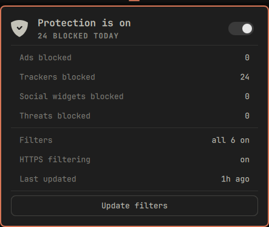

# AdGuard filtering

Ad and tracker filtering at a glance for
[AdGuard for Linux](https://adguard.com/en/adguard-linux/overview.html), on the Omarchy
bar.



The shield sits in the bar and dims when filtering stops. Open it for today's numbers,
and flip protection with the switch.

## Features

- **Today's blocks, broken down the way AdGuard breaks them down**: ads, trackers, social
  widgets and threats. Every blocked request names the filter that matched it, so the
  numbers are counted rather than estimated.
- **Protection switch.** Starts and stops the AdGuard proxy. Right click the bar mark to
  flip it without opening the panel.
- **Filter and HTTPS filtering state**, and how long ago the lists last changed.
- **Update filters**, which runs AdGuard's own update check and reports the outcome in
  the button itself.
- **Automatic filter updates** every six hours by default, driven by the lists' own
  timestamps rather than a stored clock, so restarting the shell neither loses the
  schedule nor forces a fresh download. Set the interval to 0 to turn it off.
- **Tailscale exit node warning.** AdGuard's transparent proxy and a Tailscale exit node
  cannot both be on: the proxy opens its own outbound connection and the exit node's
  default route sends it back into the tunnel, so the machine loses internet. The panel
  says so when it sees both.

The panel is a display with one switch. Filter lists are managed with `adguard-cli`,
which is where that job belongs.

## Requirements

- `adguard-cli` on `PATH`, activated and configured. The widget removes itself from the
  bar when AdGuard is not installed.
- `proxy_mode` set to `auto`, otherwise AdGuard filters nothing and the panel will
  honestly report a running proxy that is doing no work:

  ```bash
  adguard-cli config set proxy_mode auto
  ```

- `tailscale` on `PATH` is optional. Without it the exit node warning never appears.

## Install

```bash
omarchy plugin add https://github.com/thisisgm/omarchy-adguard.git --enable
omarchy bar put io.github.thisisgm.adguard
omarchy restart shell
```

## Keyboard

| Key | Action |
|---|---|
| `j` / `k` / arrows | move between the switch and the button |
| `enter` / `space` | activate the row under the cursor |
| `t` | toggle protection |
| `u` | update filters |
| `r` | refresh |
| `esc` | close |

Left click opens the panel, right click toggles protection, middle click refreshes.

## Settings

| Setting | Default | Range |
|---|---|---|
| Refresh interval (seconds) | 30 | 5 to 3600 |
| Auto-update filters every (hours) | 6 | 0 to 168, 0 disables |

## IPC

```bash
omarchy-shell adguard open
omarchy-shell adguard toggle
omarchy-shell adguard protection
omarchy-shell adguard update
omarchy-shell adguard refresh
```

## Managing filter lists

The panel reports the filter lists; it does not edit them. AdGuard's catalogue runs to
about sixty lists, and adding or removing one is a considered change rather than a bar
click:

```bash
adguard-cli filters list --all
adguard-cli filters add 18
adguard-cli filters remove 18
adguard-cli filters disable 4
```

While `auto_enable_language_filters` is on, AdGuard adds a language-specific list of its
own accord during an update, so a new row can appear in the totals. Turn it off with:

```bash
adguard-cli config set auto_enable_language_filters false
```

## How it works

The panel is strictly a display. Everything that touches AdGuard lives in
`bin/omarchy-adguard`, which prints one JSON object and always exits 0, so the panel can
always render something:

```bash
bin/omarchy-adguard status
{"ok":true,"installed":true,"running":true,"httpsFiltering":true,"blockedToday":180, ...}
```

`adguard-cli` exits 0 even when it refuses a request, so the helper never reads an exit
code. Starting or stopping protection re-reads the state afterwards and reports what it
actually observed.

The helper never calls `adguard-cli license`, and no field it prints carries the licence
key.

## Uninstall

```bash
omarchy plugin remove io.github.thisisgm.adguard
```

The plugin writes no state of its own, so nothing is left behind. AdGuard's own
configuration is untouched.

## Support

If this saved you an afternoon, you can
[buy me a coffee](https://buymeacoffee.com/thisisgm).

## Licence

MIT. See [LICENSE](LICENSE).
